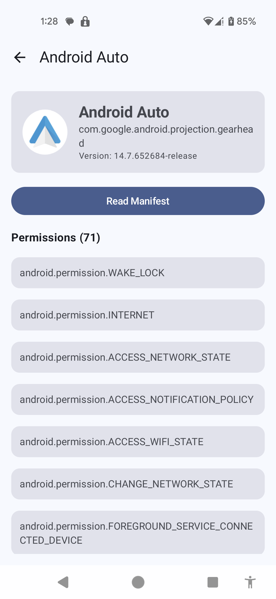
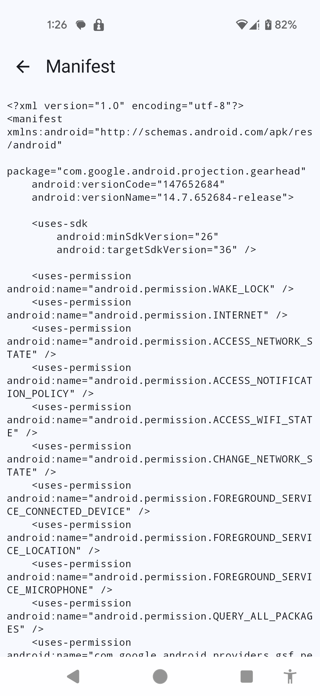

# PermissionReader

It provides comprehensive insights into installed applications on your device. The app allows users to browse installed apps, view detailed app information, inspect requested permissions, and examine AndroidManifest.xml content. 

It's designed for developers, security researchers, and users who want to understand what permissions and components their installed apps are using.

The app leverages Android's PackageManager API to extract and display app metadata, permissions, and manifest information in a clean, modern interface built with Jetpack Compose.

## App Screenshots

|  |  | 
| ---------------------------------------------- | -------------------------------------------- | -------------------------------------------

## Features

- **App List View**: Browse all installed applications on your device with support for filtering system apps
- **App Information**: View detailed information about each app including app name, package name, version, and icon
- **Permission Inspection**: See all permissions requested by any installed application
- **Manifest Viewer**: Display a reconstructed AndroidManifest.xml showing permissions, activities, services, and receivers
- **App Pinning**: Pin frequently accessed apps to the top of the list for quick access

## Tech Stack

- **Language**: Kotlin
- **UI Framework**: Jetpack Compose
- **Design System**: Material 3
- **Architecture**: MVVM (Model-View-ViewModel)
- **Dependency Injection**: Hilt
- **Navigation**: Navigation Compose
- **State Management**: StateFlow with ViewModel
- **Minimum SDK**: 24 (Android 7.0)
- **Target SDK**: 36
- **Build System**: Gradle with Kotlin DSL

## Architecture Overview

The app follows the **MVVM (Model-View-ViewModel)** architecture pattern, which promotes separation of concerns and testability.

- **Model Layer**: Consists of data models (`AppInfo`) and repository classes (`AppRepository`) that handle data retrieval from Android's PackageManager API
- **View Layer**: Composable UI screens built with Jetpack Compose that display app information and handle user interactions
- **ViewModel Layer**: ViewModels (`AppListViewModel`, `AppInfoViewModel`, `AppManifestViewModel`) manage UI state using StateFlow and coordinate between the View and Repository layers

The architecture uses Hilt for dependency injection, ensuring loose coupling between components. The repository pattern abstracts data access, making it easier to test and maintain. Navigation is handled declaratively using Navigation Compose, with type-safe route definitions.

## Getting Started

### Prerequisites

- Android Studio Hedgehog or later
- JDK 11 or higher
- Android SDK with API level 24 or higher
- Gradle 8.13.1 or compatible version

### Installation

1. Clone the repository:
   ```bash
   git clone <repository-url>
   cd PermissionReader
   ```

2. Open the project in Android Studio

3. Sync Gradle files to download dependencies

4. Build and run the app on an emulator or physical device

### Building the Project

```bash
./gradlew assembleDebug
```

For a release build:

```bash
./gradlew assembleRelease
```

## License

This project is licensed under the MIT License - see the LICENSE file for details.

## Contributors

This project welcomes contributions from anyone in the community. Feel free to submit PRs or open issues.

